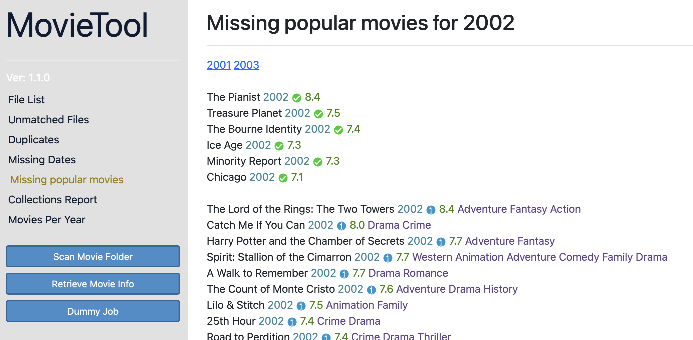
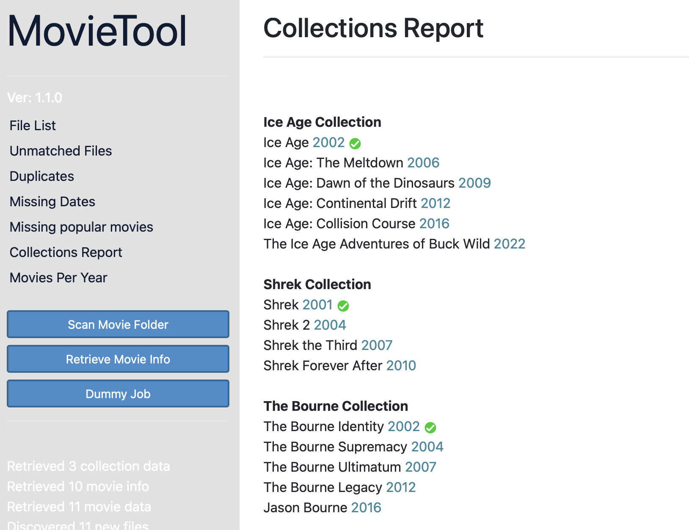
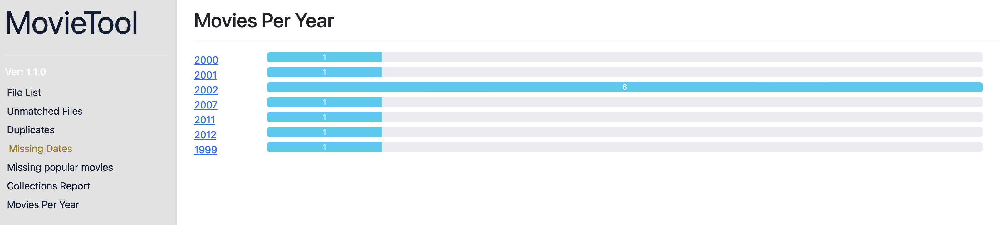

# MovieTool



A Java based application for scanning movie file collections, showing missing movies from collections, and recommending top movies per year.
A [TMDB API key](https://developers.themoviedb.org/3/getting-started/introduction) is required to use this.

This app will scan your movie/Plex library folder and provide you a nice web interface with suggestions of movies you don't have, your movie collections and what you would need to complete them, a graph of how many movies you have for each year and suggestions on the top movies for each year that are not already in your collection.

When running, access using a web browser at [http://localhost:2001](http://localhost:2001)

Example command to run app from the command line
(Substitute everything in [] with your own values)
```
java -jar -Dmovietool.datafilepath=[path to save config to] -Dmovietool.moviefolderpath=[movie folder path] -Dmovietool.tmdbapikey=[your personal TMDB api key] movietool-1.1.1.jar
```

### Features
- Scan your library and retrieve movie details from [TMDB](https://www.themoviedb.org).
- Show duplicated files.
- Show incorrectly named files.
- Show list of movie collections and what's missing.
- Show list of popular movies by year, and indicate movies you don't own.

### Expectations
- All movie files in single folder
- Movie naming format: The Mask (1994).mp4
- Movie file names should contain release year.

### Config
The following variables should be set up and changed to match your folder locations etc:
```
export MOVIETOOL_DATAFILEPATH=~/movietool.json
export MOVIETOOL_MOVIEFOLDERPATH=/Volumes/PLEX_4TB/Movies
export MOVIETOOL_ALLOWEDFILETYPES=m4v,avi,mkv,mp4
export MOVIETOOL_TMDBAPIKEY={big-ass code from TMDB}
```
MOVIETOOL_DATAFILEPATH - Set this to where you want the data cache to live
MOVIETOOL_MOVIEFOLDERPATH - Set this to the location of your movie files
MOVIETOOL_ALLOWEDFILETYPES - List of allowed movie file types
MOVIETOOL_TMDBAPIKEY - Your own personal TMDB API key

Alternatively, these parameters can be overridden on the command line.




